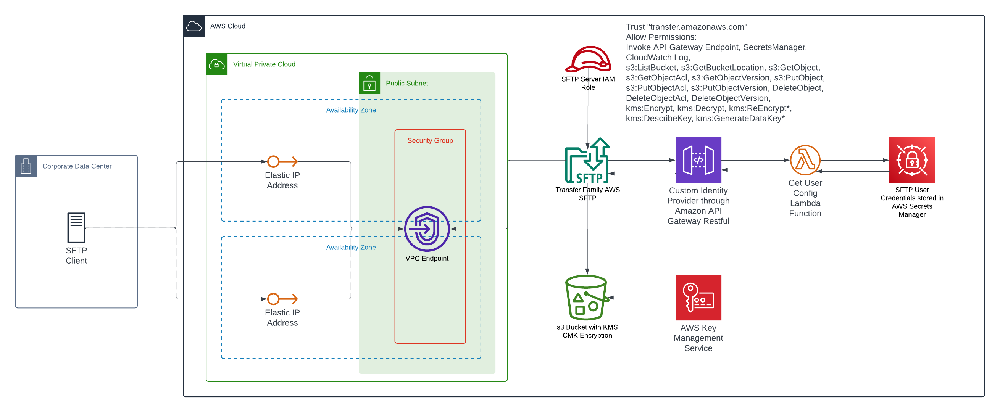

AWS Transfer Family SFTP with Custom Identity Provider using API Gateway

# AWS Transfer Family SFTP with Custom Identity Provider using Secrets Manager

This project provisions AWS Transfer Family SFTP with API Gateway/Lambda for authenticating user credentials storing in Secrets Manager  

## Table of Contents

- [Overview](#overview)
- [Architecture Diagram](#architecture-diagram)
- [Prerequisites](#prerequisites)
- [Usage](#usage)
- [Modules](#modules)
- [Inputs](#inputs)
- [Outputs](#outputs)
- [Notes](#notes)
- [References](#references)
- [License](#license)

## Overview
[WIP]
In this project, demonstrate how to create a serverless architecture on AWS to provider secure file upload services to external parties.

## Architecture Diagram

SFTP with VPC endpoints + API Gateway + Lambda + Secrets Manager


## Prerequisites

- Terraform version >= 1.0
- AWS CLI configured with appropriate credentials

## Usage

Explain how to use your Terraform project. For example:

1. Clone the repository
2. Navigate to the project directory
3. Prepare the `terraform.tfvars`
```shell
cp environments/template/terraform.tfvars.tpl environments/dev/terraform.tfvars
```
4. Initialize Terraform:
```shell
terraform init
```
5. Review the execution plan:
```shell
terraform plan -var-file environments/dev/terraform.tfvars
```
6. Apply the changes:
```shell
terraform apply -var-file environments/dev/terraform.tfvars
```

## Modules

This project uses the following modules

| Name                             | Description                                                       | Path |
|----------------------------------|-------------------------------------------------------------------|------|
| SFTP Custom IdP with API Gateway | SFTP User Authentication using Secrets storing in Secrets Manager | `./modules/sftp-custom-idp-api-gateway` |
| SFTP User Onboard                | SFTP User Onboarding                                              | `./modules/sftp-user-onboard`           |
| AWS VPC                          | Terraform module which creates VPC resources on AWS | https://registry.terraform.io/modules/terraform-aws-modules/vpc/aws/latest |

## Inputs

List and describe the input variables your project uses. For example:

| Name | Description                                                        | Type          | Default       | Required |
|------|--------------------------------------------------------------------|---------------|---------------|:--------:|
| `aws_region` | The AWS region to deploy to                                        | `string`      | `"us-east-2"` |    no    |
| `project_owner` | Project Owner - Business unit of this workload                     | `string`      |               |
| `project_name` | Project Name                                                       | `string`      |               |          |
| `environment` | Deployment environment (dev, staging, prod)                        | `string`      |               | 
| `api_gw_stage` | API Gateway Stage (dev, stage, prod)                               | `string`      | `"prod"`      |    no    |
| `sftp_name` | Name of the SFTP                                                   | `string`      | | |
| `use_vpc_endpoint` | Deploy SFTP in VPC (true) or Public (false)                        | `bool` | `false` |   no |    |
| `vpc_name` | VPC Name                                                           | `string` | `"sftp-vpc"` | no |
| `vpc_cidr` | VPC CIDR                                                           | `string` | `"10.0.0.0/16"` | no |
| `sftp_vpc_endpoint_ingress_rules` | IP Whitelist in CIDRs for each broker to access SFTP VPC Endpoint  |  list(object({ name = string, cidr = string})) | `[]` | no |
| `sftp_bucket_name_prefix` | SFTP Bucket Name Prefix | `string` | | |
| `sftp_bucket_force_destroy` | Force destroy SFTP S3 Bucket upon destruction | `bool` | `false` | no |
| `sftp_secretsmanager_secret_name_prefix` | SFTP Secrets Manager Secret Name | `string` | | |
| `sftp_users` | SFTP User Definition                           | map(object({username = string, password = string, public_key = string, ip_cidrs = set(string)})) | | |

## Outputs

| Name | Description          |
|------|----------------------|
| `sftp_server_id` | SFTP Server ID       |
| `sftp_server_endpoint` | SFTP Server Endpoint |
| `sftp_s3_bucket_name` | S3 Bucket Name       |
| `sftp_auth_lambda_arn` | Lambda ARN           |

## Test Cases
1. [WIP] Access SFTP custom domain endpoint, expecting `Custom FQDN resolve Alias/CNAME records of SFTP service endpoints FQDN`
2. [WIP] Access SFTP endpoint from a whitelisted source IP, expecting `SFTP Connected`
3. [WIP] Access SFTP endpoint from a non-whitelisted source IP, expecting `Connection timed out`
4. [WIP] Authenticate with username and password, expecting `SFTP authenticated`
5. [WIP] Authenticate with incorrect username and incorrect password, expecting `SFTP authentication failed`
6. [WIP] Update user credentials in Secrets Manager through terraform and authenticate with updated passowrd, expecting `SFTP authenticated successfully`
7. [WIP] Authenticate with public key
8. [WIP] Listing on user home folder
9. [WIP] Listing on /clearing/* user folder
10. [WIP] Try transverse to other user folder
11. [WIP] Get file from user home folder
12. [WIP] Put file into user home folder, expecting `Succeeded`
13. [WIP] Get file from /clearing/inbound, expecting `Succeeded`
14. [WIP] Put file into /clearing/inbound, expecting `Succeeded`
15. [WIP] Get file from /clearing/outbound, expecting `Succeeded`
16. [WIP] Put file into /clearing/outbound, expecting `Failure`

## Notes

### Further restrict SFTP IAM Role to access specific Secrets Manager secrets
The `sftp-server-role` allow full Read/Write access to all secrets in Secrets Manager. Further restriction should be implemented to restrict this iam role to access only SFTP user secrets stored in Secrets Manager.

### Fine Grain Authorization on `subfolders`
🚧This feature is still not yet implemented in this terraform template. Technically feasible according to AWS documentation🚧

To further restrict an authenticated user on accessing the subfolder of user logical home folder, we need to incorporate a `Policy` field in the `Get User Config Lambda` in the json respond. The policy is essence a IAM policy statement like below   
Session Policy Example:
```json
{
  "Version": "2012-10-17",
  "Statement": [
      {
          "Sid": "AllowListingOfUserFolder",
          "Action": [
              "s3:ListBucket"
          ],
          "Effect": "Allow",
          "Resource": [
              "arn:aws:s3:::${transfer:HomeBucket}"
          ],
          "Condition": {
              "StringLike": {
                  "s3:prefix": [
                      "${transfer:HomeFolder}/*",
                      "${transfer:HomeFolder}"
                  ]
              }
          }
      },
      {
          "Sid": "HomeDirObjectAccess",
          "Effect": "Allow",
          "Action": [
              "s3:PutObject",
              "s3:GetObject",
              "s3:DeleteObjectVersion",
              "s3:DeleteObject",
              "s3:GetObjectVersion",
              "s3:GetObjectACL",
              "s3:PutObjectACL"
          ],
          "Resource": "arn:aws:s3:::${transfer:HomeDirectory}/*"
       }
  ]
}
```
Restricting user to delete files in outbound folder
```json
{
  "Version": "2012-10-17",
  "Statement": [
      {
          "Sid": "AllowListingOfUserFolder",
          "Action": [
              "s3:ListBucket"
          ],
          "Effect": "Allow",
          "Resource": [
              "arn:aws:s3:::${transfer:HomeBucket}"
          ],
          "Condition": {
              "StringLike": {
                  "s3:prefix": [
                      "${transfer:HomeFolder}/*",
                      "${transfer:HomeFolder}"
                  ]
              }
          }
      },
      {
          "Sid": "HomeDirObjectAccess",
          "Effect": "Allow",
          "Action": [
              "s3:GetObject",
              "s3:GetObjectVersion",
              "s3:GetObjectACL"
          ],
          "Resource": "arn:aws:s3:::${transfer:HomeDirectory}/clearing/outbound/*"
       },
       {
          "Sid": "HomeDirObjectAccess",
          "Effect": "Allow",
          "Action": [
              "s3:PutObject",
              "s3:GetObject",
              "s3:DeleteObjectVersion",
              "s3:DeleteObject",
              "s3:GetObjectVersion",
              "s3:GetObjectACL",
              "s3:PutObjectACL"
          ],
          "Resource": "arn:aws:s3:::${transfer:HomeDirectory}/clearing/inbound/*"
       }
  ]
}
```

## References
1. [AWS Blog - Use IP whitelisting to secure your AWS Transfer for SFTP servers](https://aws.amazon.com/blogs/storage/use-ip-whitelisting-to-secure-your-aws-transfer-for-sftp-servers/)
2. [AWS Blog - Enable password authentication for AWS Transfer Family using AWS Secrets Manager (updated)](https://aws.amazon.com/blogs/storage/enable-password-authentication-for-aws-transfer-family-using-aws-secrets-manager-updated/)
3. [AWS Blog - Implement multi-factor authentication based managed file transfer using AWS Transfer Family and AWS Secrets Manager](https://aws.amazon.com/blogs/storage/implement-multi-factor-authentication-based-managed-file-transfer-using-aws-transfer-family-and-aws-secrets-manager/)
4. [AWS Blog - Detect malware threats using AWS Transfer Family](https://aws.amazon.com/blogs/storage/detect-malware-threats-using-aws-transfer-family/)
5. [AWS Samples - Transfer Family Toolkit](https://github.com/aws-samples/toolkit-for-aws-transfer-family/tree/main/solutions/custom-idp)
6. [AWS Blog - ](https://aws.amazon.com/blogs/storage/architecting-secure-and-compliant-managed-file-transfers-with-aws-transfer-family-sftp-connectors-and-pgp-encryption/)

## License

This template is licensed under the Apache 2.0 License.
